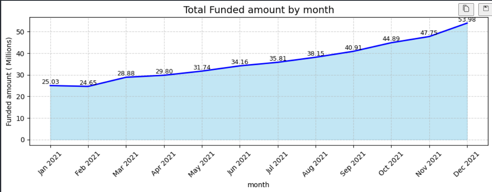
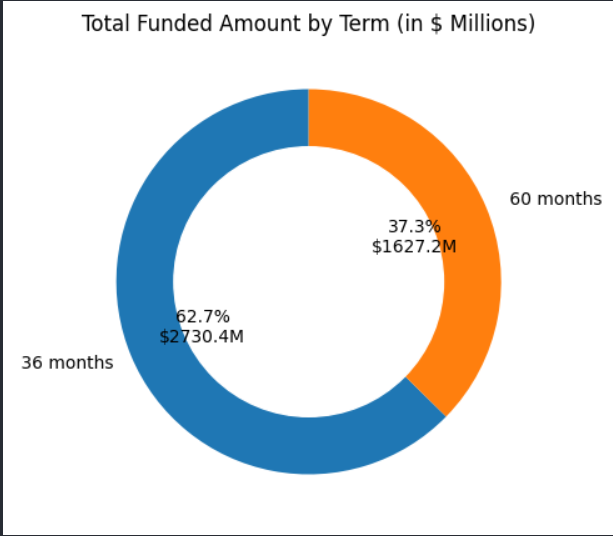
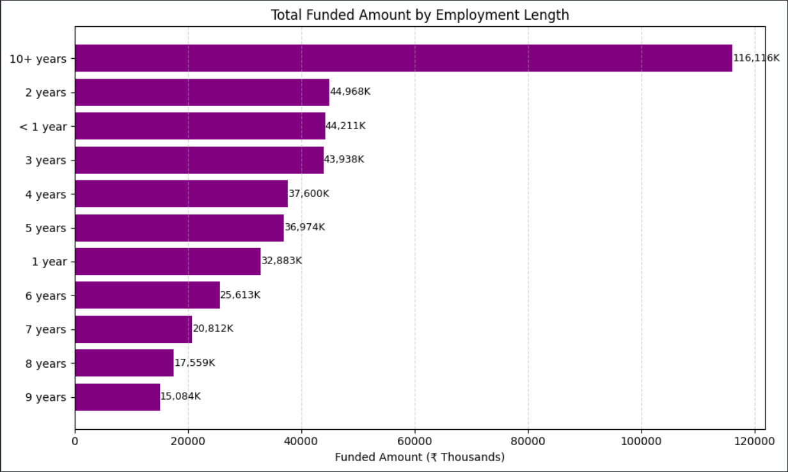
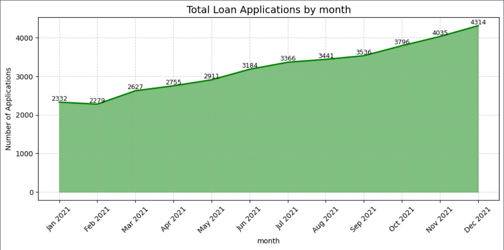
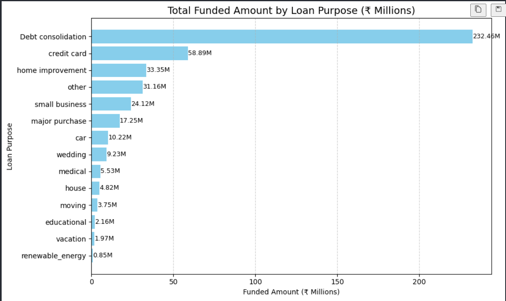

# financial-data-analysis
Financial data analysis using Python (EDA + visualization)

## 📊 Key Insights

# Financial Data Analysis

## Overview

This project analyzes financial loan data to identify trends, patterns, and insights using Python.

## Tools Used

* Python
* Pandas
* NumPy
* Matplotlib / Seaborn

## Dataset

The dataset contains information about loan applications including:

* State
* Loan amount
* Income
* Loan status
* Payment details

## Key Analysis Performed

* Data cleaning and preprocessing
* Handling missing values
* Exploratory Data Analysis (EDA)
* Visualization of trends and patterns

## Key Insights

### Regional Loan Distribution

Certain states contribute significantly higher total loan amounts.

## Loan Amount Trends

Loan amounts vary across different borrower categories.

## Top Performing Segments

A small group of segments contributes major share of loans.

## Distribution Analysis

Most loans fall within a specific value range.

## Key Observation

Identified patterns that can help in risk assessment and decision-making.

## How to Run

1. Install dependencies:
   pip install pandas matplotlib seaborn

2. Run the notebook:
   Open `financial_analysis.ipynb`

## Conclusion

This project demonstrates how data analysis can be used to extract meaningful insights from financial datasets and support business decisions.
